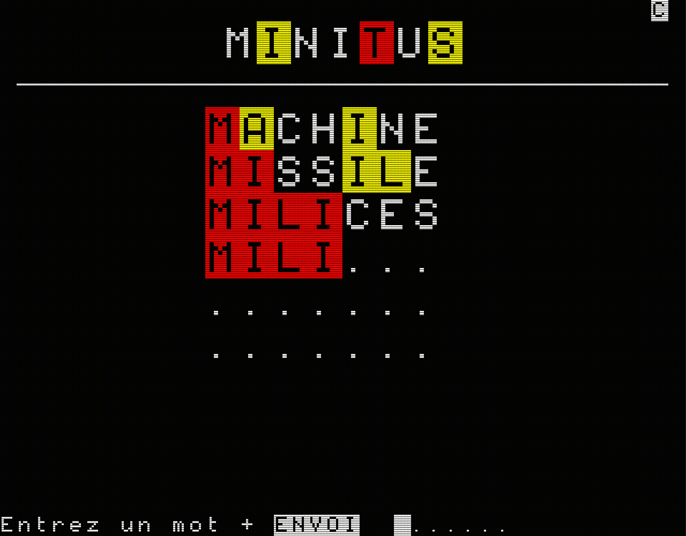
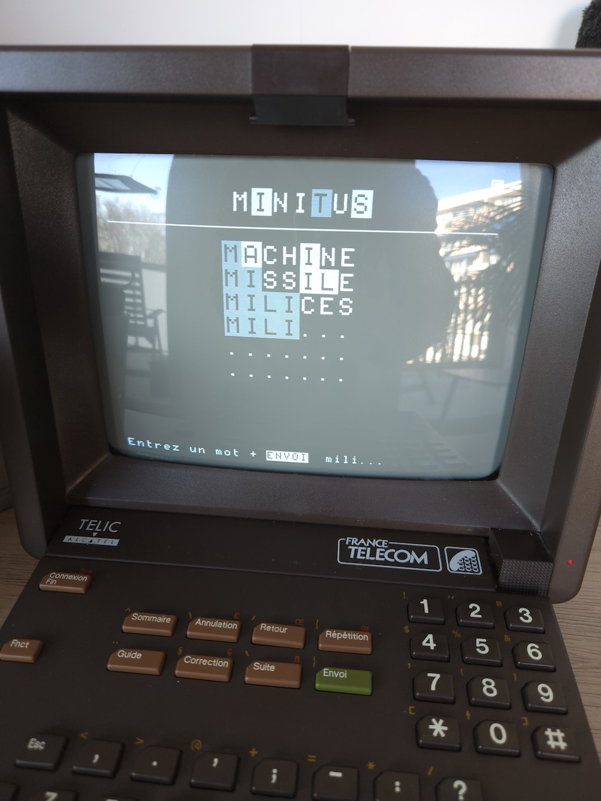

# Minitus

Motus-like sur Minitel, avec un nouveau mot à trouver chaque jour.

<table>
<tr>
<td>

</td>
<td>

</td>
</tr>
</table>

## Comment jouer

Accédez au jeu depuis [MiniPavi](http://www.minipavi.fr/) avec le code `5422*MINITUS`, depuis l'émulateur en ligne ou un vrai Minitel.

## Technologie

Minitus est développée à l'aide de [MiniPavi-Kotlin](https://github.com/outadoc/minipavi-kotlin).
